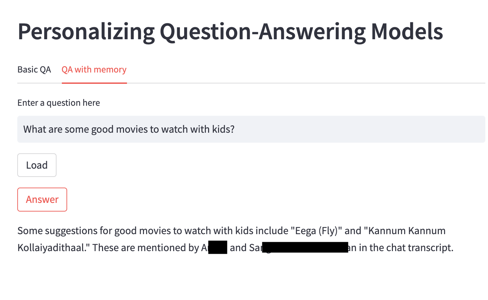
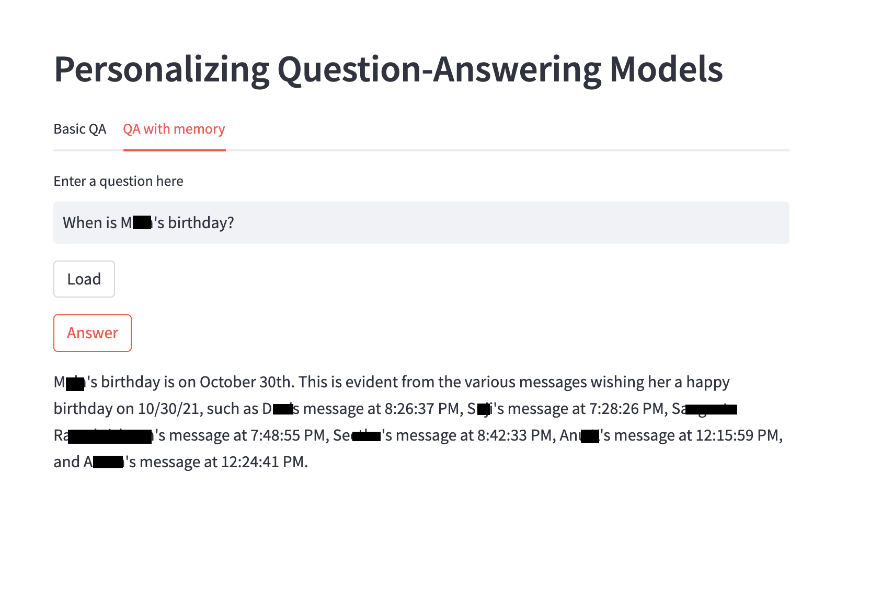

# question-answer-over-whatsapp
A Demo application demonstrating question answering over whatsapp conversations using large language models.

# How to run

## 1. Install requirements
```
pip install -r requirements.txt
```

## 2. Create an environment variable in your shell with an API key for OpenAI
Sign up for an OpenAI developer account [here](https://beta.openai.com/). Follow the instructions on the site to get your API key. Then, in your shell, run:
```
export OPENAI_API_KEY=<your key>
```

## 3. Download a WhatsApp conversation

[Export a WhatsApp conversation](https://faq.whatsapp.com/1180414079177245/?cms_platform=android) as a text file and save it in the `data` directory. The file should be named `whatsapp_export.txt`.

## 4. Run the app
```
streamlit run streamlit_app.py
```

# App overview

The app has two tabs. On the first tab called **BasicQA**, you will have to provide the snippet of conversation yourself and ask a question about it. There is a character limit of 10,000 characters that I have imposed to keep the request within the 4096 token limit.

On the second tab called **QA with memory**, the file `whatsapp_export.txt` is read and the entire conversation is processed into embedding and stored in an in-memory index as well as persisted to local disk under a folder called `vector_index`. You can ask questions about the conversation.




